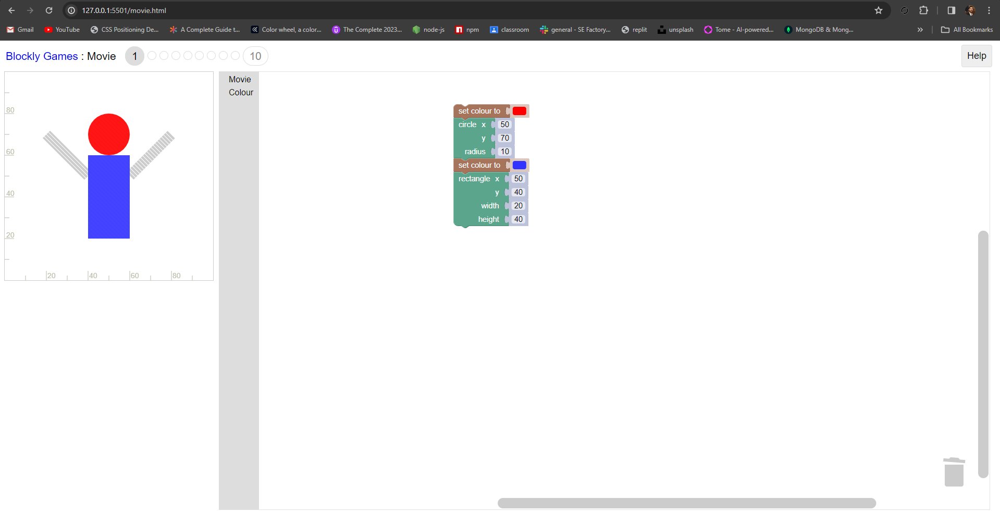

# Project Title

Welcome to our project! Below you will find the figma design  for this project, and the images screenshots if you'd like to check them out please clone the repository

## Design Peek

Explore the full design in Figma here: [Figma Design Link](https://www.figma.com/file/K1MYcN0Bdx3cBv4vueERSp/NinjaCo?type=design&node-id=0%3A1&mode=design&t=So5BTzILHTEAQ01I-1)

## Gallery

This images represents various games code:

### Grid Layout

|  |  |  |
|:-------------------------------:|:-------------------------------:|:-------------------------------:|
|           **Maze Game**           |           **Pond Duck**           |           **Bird Game**           |

|  |  |  |
|:-------------------------------:|:-------------------------------:|:-------------------------------:|
|           **Draw Game**           |           **Pond-tutor**           |           **Puzzle Game**           |

|                          |
|:-------------------------------------------------------:|
|                         **Turtle Game**                      |

for the full code [Check repo](https://github.com/GhadeerZahwe/Blockly-Games)